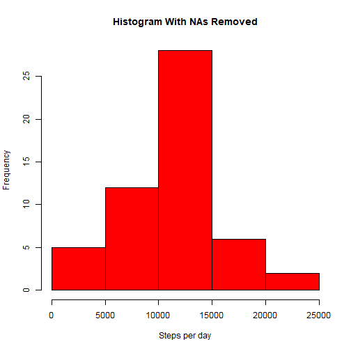
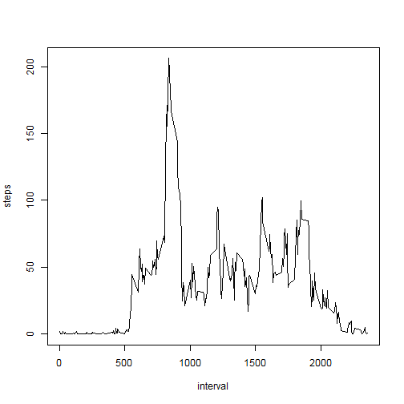
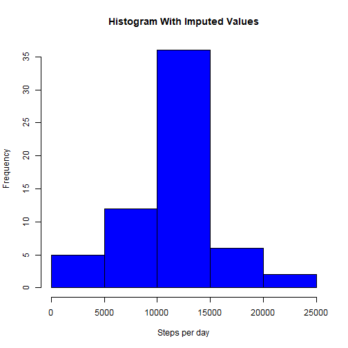
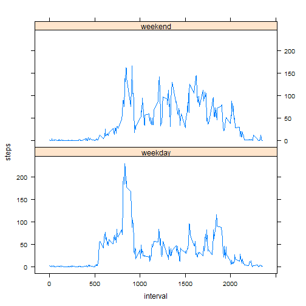

Loading and preprocessing the data

```r
rawdata <- read.csv("activity.csv")
library(dplyr)
```

```
## 
## Attaching package: 'dplyr'
## 
## The following object is masked from 'package:stats':
## 
##     filter
## 
## The following objects are masked from 'package:base':
## 
##     intersect, setdiff, setequal, union
```


What is the mean total number of steps taken per day?

```r
# Group the raw data by date
days <-group_by(rawdata, date)
# Add up the steps per day (spd)
spd <- summarize(days, steps=sum(steps))
# Plot a histogram of the total steps per day (spd) with NAs removed
hist(spd$steps,
        main="Histogram With NAs Removed",
        xlab="Steps per day",
        col="red")
```

 

```r
# Calculate the mean and median of the total number of steps taken per day
summary(spd$steps)
```

```
##    Min. 1st Qu.  Median    Mean 3rd Qu.    Max.    NA's 
##      41    8841   10760   10770   13290   21190       8
```

What is the average daily activity pattern?

```r
# Group the raw data by interval
int <- group_by(rawdata, interval)
# Find the average steps taken (ast) for each interval removing NAs
ast <- summarize(int, steps=mean(steps, na.rm = TRUE))
# Plot a time series of the 5-minute interval and ast
with(ast, plot(interval, steps, type = "l"))
```

 

```r
# Find which 5-minute interval contains the max number of steps
maxsteps <- max(ast$steps)
maxfinder <- grep(maxsteps, ast$steps)
ast[maxfinder, 1]
```

```
## Source: local data frame [1 x 1]
## 
##   interval
## 1      835
```

Imputing missing values

```r
# make a copy of the raw data that will hold the imputed values
impdata <- rawdata
# calculate how many NAs are in the dataset
sum(is.na(impdata))
```

```
## [1] 2304
```

```r
# calculate the average steps taken in each interval without NAs
intavg <- summarize(int, steps=mean(steps, na.rm = TRUE))
# loop through and impute the average for each interval to corresponding
# intervals that have NAs
length<-nrow(impdata)
for(i in 1:length){
     if(is.na(impdata[i,1])==TRUE){
          reg_exp <- paste("^", impdata[i,3], "$", sep = "")
          findint <- grep(reg_exp, intavg$interval)
          impdata[i,1] <- intavg[findint,2]
     }
}
# group the imputed data by days
days2 <-group_by(impdata, date)
# calculate the total number of steps taken per day (spd)
spd2 <- summarize(days2, steps=sum(steps))
# plot a histogram of the steps per day with imputed values
hist(spd2$steps,
        main="Histogram With Imputed Values",
        xlab="Steps per day",
        col="blue")
```

 

```r
# Calculate the mean and median of the total number of steps taken per day
summary(spd2$steps)
```

```
##    Min. 1st Qu.  Median    Mean 3rd Qu.    Max. 
##      41    9819   10770   10770   12810   21190
```

Are there any differences in activity patterns between weekdays and weekends?

```r
# assign each day to a day of the week and then create a new column that
# holds whether that day is a weekday or weekend
impdata$day <- ifelse(weekdays(as.POSIXct(impdata$date))=="Saturday"|
                      weekdays(as.POSIXct(impdata$date))=="Sunday", 
                      "weekend", "weekday")

# filter the imputed data by "weekday"
weekdays <- filter(impdata, day=="weekday")
# group the weekdays by interval
wkdaysint<- group_by(weekdays, interval)
# find the average steps taken (ast) for weekday intervals
wkdaysast <- summarize(wkdaysint, steps=mean(steps, na.rm = TRUE))
# create a new column to identify the data as a "weekday"
wkdaysast$day <- "weekday"

# repeat the same process for the weekends
weekends <- filter(impdata, day=="weekend")
wkendsint<- group_by(weekends, interval)
wkendsast <- summarize(wkendsint, steps=mean(steps, na.rm = TRUE))
wkendsast$day <- "weekend"

# recombine the weekdays and weekends by row binding
recombined <- rbind(wkdaysast, wkendsast)

# plot steps vs the interval for the recombined data using the "day" as
# a factor
library(lattice)
xyplot(steps ~ interval | day, data = recombined, layout = c(1,2), type = "l")
```

 

